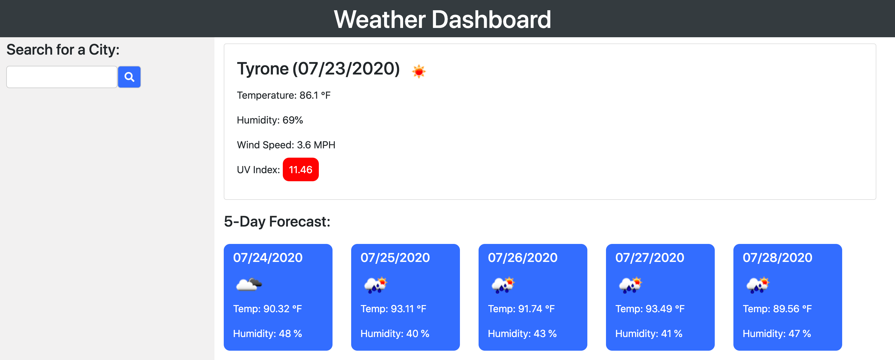
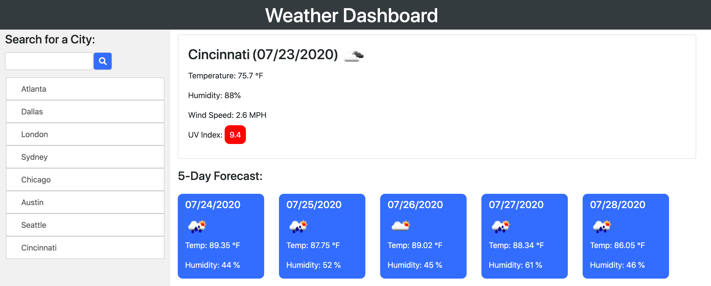

# Weather Dashboard

This is a weather app that uses API's to provide the weather for your current location and allows the user to search for any cities weather. It then saves those recent searches as buttons.

This app uses the openweathermap API, Moment.js, fontawesome, JQuery, AJAX GET requests, functions, loops, and more. 

# Weather information for each city:

## Current weather includes:
    -An image representation of the weather
    -Current Temperature in fahrenheit
    -Current humidity
    -Current wind speed
    -Current UV Index and a color code to show the danger

## 5 day forecast includes:
    -An image representation of the weather for each day
    -Temperature for each day in fahrenheit
    -Humidity for each day

## [Click Here to check it out!](https://jacoblovins.github.io/weather_dashboard/)

